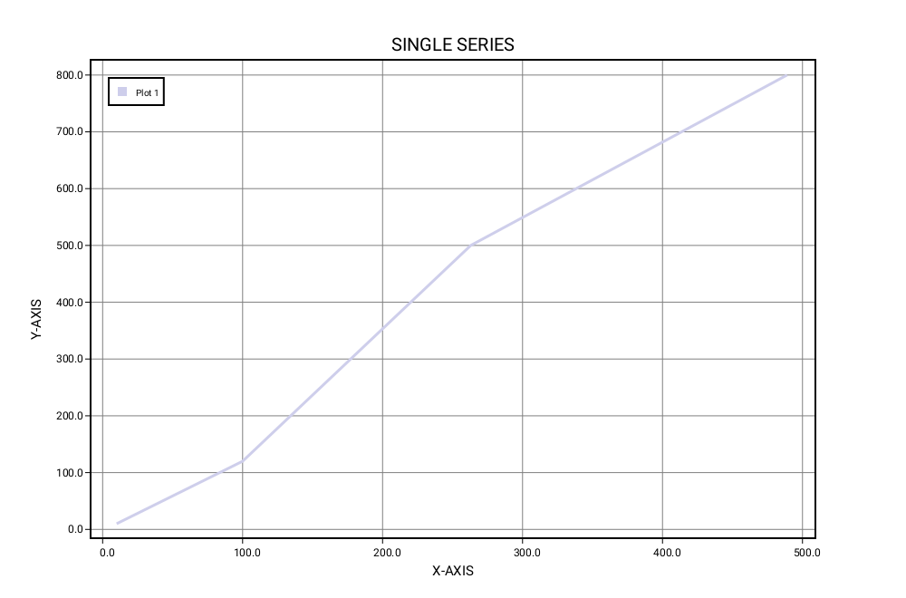
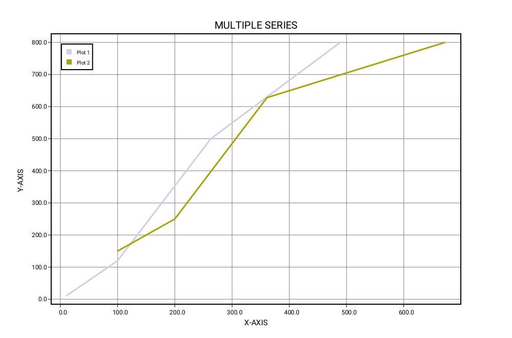

# SwiftPlot

[](https://opensource.org/licenses/Apache-2.0)

## Overview
The SwiftPlot framework is a cross-platform library that lets you plot graphs natively in Swift.
The existing Swift plotting frameworks (such as CorePlot) run only on iOS or Mac.
The idea behind SwiftPlot is to create a cross-platform library that runs on iOS, Mac, Linux and Windows.
</br>
</br>
SwiftPlot currently uses two rendering backends to generate plots:
- Anti-Grain Geometry(AGG) C++ rendering library
- A simple SVG Renderer

To encode the plots as PNG images it uses the [lodepng](https://github.com/lvandeve/lodepng) library.
</br>
SwiftPlot can also be used in Jupyter Notebooks.
</br>
Examples, demonstrating all the features, have been included with the repository under the `examples` directory.
To run the examples, clone the repository, and run the run_examples.sh script as shown below.

```console
run_examples.sh
```

The resultant images are stored in the `examples/Reference` directory. The images rendered by each of the backends are stored their respective directories: agg and svg.Examples

## How to include the library in your package
Add the library to your projects dependencies in the Package.swift file as shown below.
```swift
dependencies: [
        .package(url: "https://github.com/KarthikRIyer/swiftplot.git", .exact("0.0.1")),
    ],
```

## How to include the library in your Jupyter Notebook
Add this line to the first cell:
```swift
%install '.package(url: "https://github.com/KarthikRIyer/swiftplot", from: "0.0.1")' SwiftPlot
```
In order to display the generated plot in the notebook, add this line:
```swift
%include "EnableIPythonDisplay.swift"
```

## Examples
Here are some examples to provide you with a headstart to using this library. Here we will be looking at plots using only the AGGRenderer, but the procedure will remain the same for SVGRenderer too.
To use the library in your package, include it as a dependency to your target, in the Package.swift file.

<b>Simple Line Graph</b>

```swift
import SwiftPlot
import AGGRenderer

let x:[Float] = [0,100,263,489]
let y:[Float] = [0,320,310,170]

var agg_renderer: AGGRenderer = AGGRenderer()
var plotTitle: PlotTitle = PlotTitle()
var lineGraph: LineGraph = LineGraph()
lineGraph.addSeries(x, y, label: "Plot 1", color: Color.lightBlue)
plotTitle.title = "SINGLE SERIES"
lineGraph.plotTitle = plotTitle
lineGraph.drawGraphAndOutput(fileName: "lineChartSingleSeries", renderer: agg_renderer)
```


<b>Line Graph with multiple series of data</b>

```swift
import SwiftPlot
import AGGRenderer
import SVGRenderer

let x1:[Float] = [0,100,263,489]
let y1:[Float] = [0,320,310,170]
let x2:[Float] = [0,50,113,250]
let y2:[Float] = [0,20,100,170]

var agg_renderer: AGGRenderer = AGGRenderer()
var plotTitle: PlotTitle = PlotTitle()
var lineGraph: LineGraph = LineGraph()
lineGraph.addSeries(x1, y1, label: "Plot 1", color: Color.lightBlue)
lineGraph.addSeries(x2, y2, label: "Plot 2", color: Color.orange)
plotTitle.title = "MULTIPLE SERIES"
lineGraph.plotTitle = plotTitle
lineGraph.drawGraphAndOutput(fileName: "lineChartMultipleSeries", renderer: agg_renderer)
```



<b>Line Graph with Sub Plots stacked horizontally</b>

```swift
import SwiftPlot
import AGGRenderer

let x:[Float] = [0,100,263,489]
let y:[Float] = [0,320,310,170]

var agg_renderer: AGGRenderer = AGGRenderer()
var plotTitle: PlotTitle = PlotTitle()
var plots = [Plot]()

var lineGraph1: LineGraph = LineGraph()
lineGraph1.addSeries(x, y, label: "Plot 1", color: Color.lightBlue)
plotTitle.title = "PLOT 1"
lineGraph1.plotTitle = plotTitle

var lineGraph2: LineGraph = LineGraph()
lineGraph2.addSeries(x, y, label: "Plot 2", color: Color.orange)
plotTitle.title = "PLOT 2"
lineGraph2.plotTitle = plotTitle

plots.append(lineGraph1)
plots.append(lineGraph2)

var subPlot: SubPlot = SubPlot(numberOfPlots: 2, stackPattern: SubPlot.HORIZONTALLY_STACKED)
subPlot.draw(plots: plots, renderer: agg_renderer, fileName: "subPlotsHorizontallyStacked")
```


<b>Plot functions using LineGraph</b>

```swift
import Foundation
import SwiftPlot
import AGGRenderer

func function(_ x: Float)->Float {
    return 1.0/x
}

var agg_renderer: AGGRenderer = AGGRenderer()
var plotTitle: PlotTitle = PlotTitle()
var lineGraph: LineGraph = LineGraph()
lineGraph.addFunction(function, minX: -5.0, maxX: 5.0, numberOfSamples: 400, label: "Function", color: Color.orange)
plotTitle.title = "FUNCTION"
lineGraph.plotTitle = plotTitle
lineGraph.drawGraphAndOutput(fileName: "functionPlotLineGraph", renderer: agg_renderer)
```


<b>Displaying plots in Jupyter Notebook</b>

You can display plots in Jupyter Notebook using only the AGGRenderer.
To do so, create the plots as shown in the above examples and instead of using the `drawGraphAndOutput` function from LineGraph, use the `drawGraph` function, then get a base64 encoded image from the AGGRenderer and pass it to the display function as showm below:
```swift
lineGraph.drawGraph(renderer: agg_renderer)
display(base64EncodedPNG: agg_renderer.base64Png())
```

## How does it work

All the plotting code, utility functions, and necessary types are included in the SwiftPlot module. Each Renderer is implemented as a separate module. Each Renderer must have SwiftPlot as its dependency and must conform to the Renderer protocol defined in Renderer.swift in the SwiftPlot module.
The Renderer protocol defines all the necessary functions that a Renderer needs to implement. 
Each Plot must conform to the Plot protocol. At the moment this protocol defines the necessary variablse and functions that each Plot must implement in order to support SubPlots.
</br></br>
You can add series to the plots using their respective functions(`addSeries` for LineGraph). This is stored in as an array of Series objects. You can set other properties such as plotTitle, plotLabel, plotDimensions, etc. To actually generate the plot you need to call either the `drawGraph` or `drawGraphAndOutput` function. This calculates all the parameters necessary to generate the plots such as the coordinates of the border, scaled points to plot, etc. Then it sends over this information to the renderer which has functions to draw primitives like lines, rectangles and text.
</br></br>
In case the Renderer is in C++(here in the case of AGG), a C wrapper is written which is in turn wrapped in Swift.
</br></br>
In order to display the plots in Jupyter notebook, we encode the image(which is in the form of an RGB buffer) to a PNG image in memory and return the encoded image to the Swift code where it is stored as NSData. Then it is encoded to base64 and passed to the display function in swift-jupyter which finally displays the image.

## Documentation

<b>LineGraph</b>

|Function                                                                            |Description                                 |
|------------------------------------------------------------------------------------|--------------------------------------------|
|init(points: [Point], width: Float = 1000, height: Float = 660)                     |Initialize a LineGraph with a set of points |
|init(width: Float = 1000, height: Float = 660)                                      |Initialize a LineGraph                      |
|addSeries(_ s: Series)                                                              |Add a series to the plot                    |
|addSeries(points p: [Point], label: String, color: Color = Color.lightBlue)         |Add a series to the plot with a set of points, a label and a color for the series |
|addSeries(_ x: [Float], _ y: [Float], label: String, color: Color = Color.lightBlue)|Add a series to the plot with a set of x and y coordinates, a label and a color for the series|
|addFunction(_ function: (Float)->Float, minX: Float, maxX: Float, numberOfSamples: Int = 400, label: String, color: Color = Color.lightBlue)|Add a function to plot along with the range of x-coordinates over which to plot, number of samples of the function to take for plotting, a label, and color for the plot|
|drawGraphAndOutput(fileName name: String = "swift_plot_line_graph", renderer: Renderer)|Generate the plot and save the resultant image|
|drawGraphOutput(fileName name: String = "swift_plot_line_graph", renderer: Renderer)|Save the generated plot to disk|

<b>SubPlot</b>

|Static Constants(to be passed in place of stackPattern in the initializer)|
|--------------------------------------------------------------------------|
|VERTICALLY_STACKED: Int = 0                                               |
|HORIZONTALLY_STACKED: Int = 1                                             |
|GRID_STACKED: Int = 2                                                     |

|Function                                                                            |Description                                 |
|------------------------------------------------------------------------------------|--------------------------------------------|
|init(width: Float = 1000, height: Float = 660, numberOfPlots n: Int = 1, numberOfRows nR: Int = 1, numberOfColumns nC: Int = 1, stackPattern: Int = 0)|Initialize a SubPlot |
|draw(plots: [Plot], renderer: Renderer, fileName: String = "subPlot_output")|Generate plot with the plots passed in as Sub Plots and save the image to disk|

<b>PlotDimensions</b>

|Function                                                  |Description                                                    |
|----------------------------------------------------------|---------------------------------------------------------------|
|init(frameWidth : Float = 1000, frameHeight : Float = 660)|Create a PlotDimensions variable with a frame width and height |

<b>Point</b>

|Property            |
|--------------------|
|x: Float = "X-Axis  |
|y: Float = "Y-Axis" |

|Function                    |Description                              |
|----------------------------|-----------------------------------------|
|init(_ x: Float, _ y: Float)|Create a Point with an x and y coordinate|

<b>PlotLabel</b>

|Property                          |
|----------------------------------|
|xLabel: String = "X-Axis"         |
|yLabel: String = "Y-Axis"         |
|labelSize: Float = 10             |

<b>PlotTitle</b>

|Property                |
|------------------------|
|title : String = "TITLE"|
|titleSize : Float = 15  |

<b>Color</b>

|Function                                            |Description                                                                |
|----------------------------------------------------|--------------------------------------------------------------------------|
|init(_ r: Float, _ g: Float, _ b: Float, _ a: Float)|Create a Color r, g, b and a values. Each of them being between 0.0 and 1.0|

<b>PlotLabel</b>

|Property                          |
|----------------------------------|
|xLabel: String = "X-Axis"         |
|yLabel: String = "Y-Axis"         |
|labelSize: Float = 10             |

## Limitations
- Currently we cannot change the plot dimensions in case the AGGRenderer is used. The plot can be generated with the default dimensions i.e. 1000x660. This issue will be fixed in the future.

## Credits
1. Maxim Shemanarev : The AGG library is directly used to render plots.
2. [Lode Vandevenne](https://github.com/lvandeve) : The lodepng library is directly used to encode PNG images.
3. [Brad Larson](https://github.com/BradLarson) and [Marc Rasi](https://github.com/marcrasi) for their invaluable guidance

## License

<b>SwiftPlot</b> is licensed under `Apache 2.0`. View [license](https://github.com/KarthikRIyer/swiftplot/blob/master/LICENSE)
