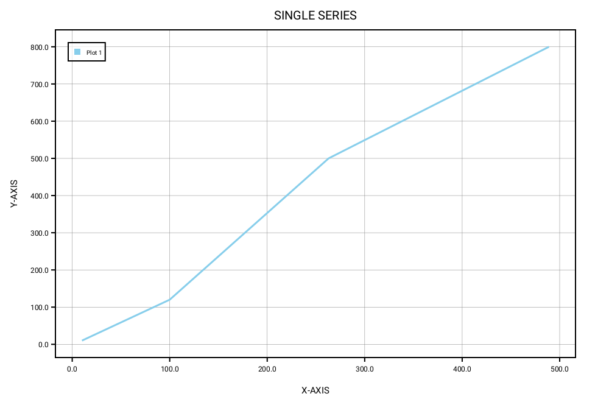
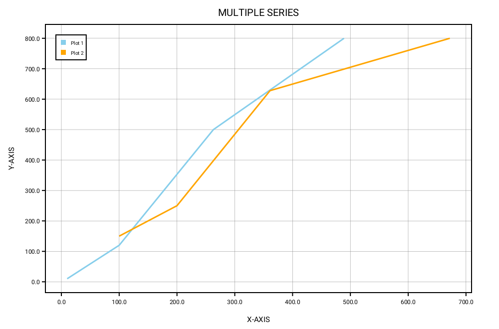
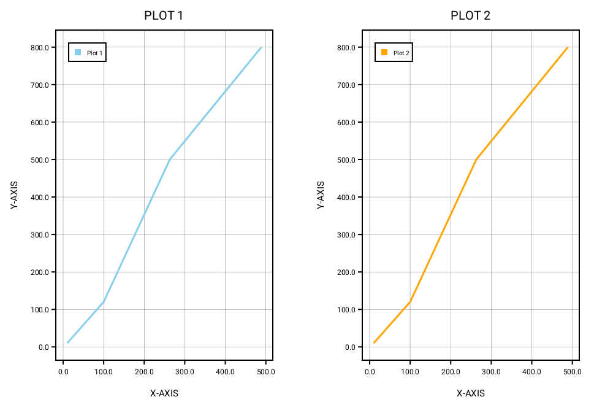
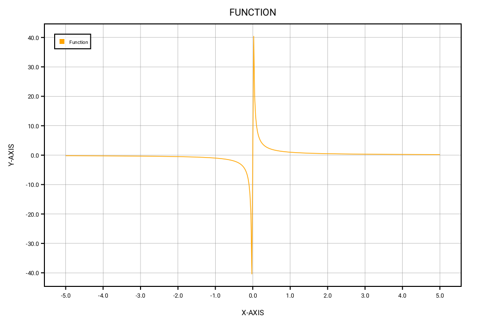
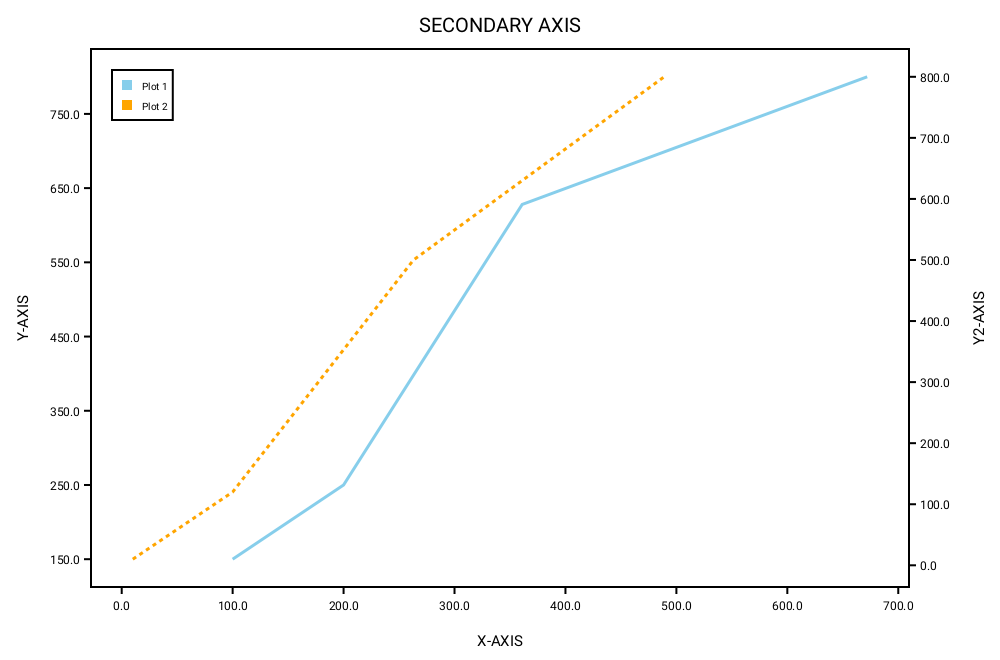

<div></div>
<br>

[](https://opensource.org/licenses/Apache-2.0)
<br>

# Table of contents

  * [Overview](#overview)
  * [License](#license)
  * [How to include the library in your package](#how-to-include-the-library-in-your-package)
  * [How to include the library in your Colab Notebook](#how-to-include-the-library-in-your-colab-notebook)
  * [How to setup Docker instance for SwiftPlot](#how-to-setup-docker-instance-for-swiftplot)
  * [Examples](#examples)
    * [Simple Line Graph](#simple-line-graph)
    * [Line Graph with multiple series of data](#line-graph-with-multiple-series-of-data)
    * [Line Graph with Sub Plots stacked horizontally](#line-graph-with-sub-plots-stacked-horizontally)
    * [Plot functions using LineGraph](#plot-functions-using-linegraph)
    * [Using a secondary axis in LineGraph](#using-a-secondary-axis-in-linegraph)
    * [Displaying plots in a Jupyter Notebook](#displaying-plots-in-a-jupyter-notebook)
  * [How does this work ?](#how-does-this-work)
  * [Documentation](#documentation)
  * [Limitations](#limitations)
  * [Guidelines for Contributors](#guidelines-for-contributors)
  * [Credits](#credits)

## Overview
The SwiftPlot framework is a cross-platform library that lets you plot graphs natively in Swift.
The existing Swift plotting frameworks (such as CorePlot) run only on iOS or Mac.
The idea behind SwiftPlot is to create a cross-platform library that runs on iOS, Mac, Linux and Windows.
</br>
</br>
SwiftPlot currently uses three rendering backends to generate plots:
- Anti-Grain Geometry(AGG) C++ rendering library
- A simple SVG Renderer
- A Core Graphics renderer with support for macOS, iOS, watchOS and tvOS

To encode the plots as PNG images it uses the [lodepng](https://github.com/lvandeve/lodepng) library.
</br>
SwiftPlot can also be used in Jupyter Notebooks, with Python interop support for Google Colab.
</br>

Examples, demonstrating all the features, have been included with the repository under the `Tests/SwiftPlotTests` directory. To run the examples, clone the repository, and run the `swift test` command from the package directory.

Jupyter Notebook examples are under the `Notebooks` directory.

The resultant images are stored in a directory named  `output`. The `Tests` folder includes a collection of reference images in the `Reference` directory.


## License

<b>SwiftPlot</b> is licensed under `Apache 2.0`. View [license](https://github.com/KarthikRIyer/swiftplot/blob/master/LICENSE)

## How to include the library in your package
Add the library to your projects dependencies in the Package.swift file as shown below.
```swift
dependencies: [
    .package(url: "https://github.com/KarthikRIyer/swiftplot.git", from: "2.0.0")),
],
```

In case you get an error saying that a file <b>ft2build.h</b> is not found, you need to install the freetype development package.

<b>Linux</b></br>
```console
sudo apt-get install libfreetype6-dev
```

<b>macOS</b></br>
```console
brew install freetype
```

If the above method doesn't work you can also build and install freetype on your own. You can find the source code and build instructions [here](https://www.freetype.org/download.html).

## How to include the library in your Colab Notebook

Add these lines to the first cell:
```swift
%install '.package(url: "https://github.com/KarthikRIyer/swiftplot", branch: "master")' SwiftPlot AGGRenderer
```
In order to display the generated plot in the notebook, add this line to a new cell:
```swift
%include "EnableIPythonDisplay.swift"
```
Note that because Google Colab doesn't natively support Swift libraries that produce rich output, we use Swift's Python interop as a workaround. 

## How to setup Docker instance for SwiftPlot
For computers running MacOS or Windows, Docker instance is to easy to setup and use `swift-jupyter`. Please refer [SwiftPlot_Docker_setup.md](https://github.com/KarthikRIyer/swiftplot/blob/master/Swiftplot_Docker_setup.md) for setup instructions.

> Warning: `swift-jupyter` uses an outdated Swift toolchain and is no longer maintained. Its successor, [Swift-Colab](https://github.com/philipturner/swift-colab), does not currently support Docker. Look at Swift-Colab's repository for up-to-date information on Docker support.

## Examples
Here are some examples to provide you with a headstart to using this library. Here we will be looking at plots using only the AGGRenderer, but the procedure will remain the same for SVGRenderer.
To use the library in your package, include it as a dependency to your target, in the Package.swift file.

More tests can be found in the [SwiftPlotTests](Tests/SwiftPlotTests) folder.

#### Simple Line Graph

```swift
import SwiftPlot
import AGGRenderer

let x:[Float] = [10,100,263,489]
let y:[Float] = [10,120,500,800]

var agg_renderer: AGGRenderer = AGGRenderer()
var lineGraph = LineGraph<Float,Float>(enablePrimaryAxisGrid: true)
lineGraph.addSeries(x, y, label: "Plot 1", color: .lightBlue)
lineGraph.plotTitle.title = "SINGLE SERIES"
lineGraph.plotLabel.xLabel = "X-AXIS"
lineGraph.plotLabel.yLabel = "Y-AXIS"
lineGraph.plotLineThickness = 3.0
lineGraph.drawGraphAndOutput(fileName: filePath+"agg/"+fileName, renderer: agg_renderer)
```


#### Line Graph with multiple series of data

```swift
import SwiftPlot
import AGGRenderer
import SVGRenderer

let x1:[Float] = [0,100,263,489]
let y1:[Float] = [0,320,310,170]
let x2:[Float] = [0,50,113,250]
let y2:[Float] = [0,20,100,170]

var agg_renderer: AGGRenderer = AGGRenderer()
var lineGraph = LineGraph<Float,Float>(enablePrimaryAxisGrid: true)
lineGraph.addSeries(x1, y1, label: "Plot 1", color: .lightBlue)
lineGraph.addSeries(x2, y2, label: "Plot 2", color: .orange)
lineGraph.plotTitle.title = "MULTIPLE SERIES"
lineGraph.plotLabel.xLabel = "X-AXIS"
lineGraph.plotlabel.yLabel = "Y-AXIS"
lineGraph.plotLineThickness = 3.0
lineGraph.drawGraphAndOutput(fileName: filePath+"agg/"+fileName, renderer: agg_renderer)
```



#### Line Graph with Sub Plots stacked horizontally

```swift
import SwiftPlot
import AGGRenderer

let x:[Float] = [10,100,263,489]
let y:[Float] = [10,120,500,800]

var agg_renderer: AGGRenderer = AGGRenderer()
var subplot = SubPlot(layout: .horizontal)

var lineGraph1 = LineGraph<Float,Float>(enablePrimaryAxisGrid: true)
lineGraph1.addSeries(x, y, label: "Plot 1", color: .lightBlue)
lineGraph1.plotTitle.title = "PLOT 1"
lineGraph1.plotLabel.xLabel = "X-AXIS"
lineGraph1.plotLabel.yLabel = "Y-AXIS"
lineGraph1.plotLineThickness = 3.0

var lineGraph2 = LineGraph<Float,Float>(enablePrimaryAxisGrid: true)
lineGraph2.addSeries(x, y, label: "Plot 2", color: .orange)
lineGraph2.plotTitle.title = "PLOT 2"
lineGraph2.plotLabel.xLabel = "X-AXIS"
lineGraph2.plotLabel.yLabel = "Y-AXIS"
lineGraph2.plotLineThickness = 3.0

subplot.plots = [lineGraph1, lineGraph2]
subplot.drawGraphAndOutput(fileName: "subPlotsHorizontallyStacked", renderer: agg_renderer)
```



#### Plot functions using LineGraph

```swift
import Foundation
import SwiftPlot
import AGGRenderer

func function(_ x: Float)->Float {
    return 1.0/x
}

var agg_renderer: AGGRenderer = AGGRenderer()
var lineGraph = LineGraph<Float,Float>(enablePrimaryAxisGrid: true)
lineGraph.addFunction(function, minX: -5.0, maxX: 5.0, numberOfSamples: 400, clampY: -50...50, label: "Function", color: .orange)
lineGraph.plotTitle.title = "FUNCTION"
lineGraph.plotLabel.xLabel = "X-AXIS"
lineGraph.plotLabel.yLabel = "Y-AXIS"
lineGraph.drawGraphAndOutput(fileName: "functionPlotLineGraph", renderer: agg_renderer)
```



#### Using a secondary axis in LineGraph

```swift
import SwiftPlot
import AGGRenderer

let x:[Float] = [10,100,263,489]
let y:[Float] = [10,120,500,800]
let x1:[Float] = [100,200,361,672]
let y1:[Float] = [150,250,628,800]

var agg_renderer: AGGRenderer = AGGRenderer() 
var lineGraph = LineGraph<Float,Float>()
lineGraph.addSeries(x1, y1, label: "Plot 1", color: .lightBlue, axisType: .primaryAxis)
lineGraph.addSeries(x, y, label: "Plot 2", color: .orange, axisType: .secondaryAxis)
lineGraph.plotTitle.title = "SECONDARY AXIS"
lineGraph.plotLabel.xLabel = "X-AXIS"
lineGraph.plotLabel.yLabel = "Y-AXIS"
lineGraph.plotLineThickness = 3.0
lineGraph.drawGraphAndOutput(fileName: filePath+"agg/"+fileName, renderer: agg_renderer)
```
The series plotted on the secondary axis are drawn dashed.



#### Displaying plots in a Jupyter Notebook

You can display plots in a Jupyter Notebook using only the AGGRenderer.
To do so, create the plots as shown in the above examples and instead of using the `drawGraphAndOutput` function from LineGraph, use the `drawGraph` function, then get a base64 encoded image from the AGGRenderer and pass it to the display function as shown below:
```swift
lineGraph.drawGraph(renderer: agg_renderer)
display(base64EncodedPNG: agg_renderer.base64Png())
```

## How does this work

All the plotting code, utility functions, and necessary types are included in the SwiftPlot module. Each Renderer is implemented as a separate module. Each Renderer must have SwiftPlot as its dependency and must conform to the Renderer protocol defined in Renderer.swift in the SwiftPlot module. Each plot type is a generic that accepts data conforming to a protocol, FloatConvertible. At the moment FloatConvertible supports both Float and Double.
The Renderer protocol defines all the necessary functions that a Renderer needs to implement. 
Each Plot must conform to the Plot protocol. At the moment this protocol defines the necessary variablse and functions that each Plot must implement in order to support SubPlots.
</br></br>
You can add series to the plots using their respective functions(`addSeries` for LineGraph). This is stored in as an array of Series objects. You can set other properties such as plotTitle, plotLabel, plotDimensions, etc. To actually generate the plot you need to call either the `drawGraph` or `drawGraphAndOutput` function. This calculates all the parameters necessary to generate the plots such as the coordinates of the border, scaled points to plot, etc. Then it sends over this information to the renderer which has functions to draw primitives like lines, rectangles and text.
</br></br>
In case the Renderer is in C++(here in the case of AGG), a C wrapper is written which is in turn wrapped in Swift.
</br></br>
In order to display the plots in Jupyter notebook, we encode the image(which is in the form of an RGB buffer) to a PNG image in memory and return the encoded image to the Swift code where it is stored as NSData. Then it is encoded to base64 and passed to the display function in swift-jupyter which finally displays the image.

## Documentation

### LineGraph<T: FloatConvertible, U: FloatConvertible>

|Function                                                                            |Description                                 |
|------------------------------------------------------------------------------------|--------------------------------------------|
|init(points: [Point], width: Float = 1000, height: Float = 660, enablePrimaryAxisGrid: Bool = false, enableSecondaryAxisGrid: Bool = false)| Initialize a LineGraph with a set of points |
|init(width: Float = 1000, height: Float = 660, enablePrimaryAxisGrid: Bool = false,enableSecondaryAxisGrid: Bool = false)| Initialize a LineGraph|
|addSeries(_ s: Series, axisType: Axis.Location = Axis.Location.primaryAxis)| Add a series to the plot                    |
|addSeries(points p: [Point], label: String, color: Color = Color.lightBlue, axisType: Axis<T,U>.Location = Axis<T,U>.Location.primaryAxis)         |Add a series to the plot with a set of points, a label and a color for the series |
|addSeries(_ x: [Float], _ y: [Float], label: String, color: Color = Color.lightBlue, axisType: Axis<T,U>.Location = Axis<T,U>.Location.primaryAxis)|Add a series to the plot with a set of x and y coordinates, a label and a color for the series|
|addSeries(_ y: [Float], label: String, color: Color = Color.lightBlue, axisType: Axis<T,U>.Location = Axis<T,U>.Location.primaryAxis)|Add a series to the plot with only the y-coordinates. The x-coordinates are automatically enumerated [1, 2, 3, ...]|
|addFunction(_ function: (Float)->Float, minX: Float, maxX: Float, numberOfSamples: Int = 400, label: String, color: Color = Color.lightBlue, axisType: Axis.Location = Axis.Location.primaryAxis)|Add a function to plot along with the range of x-coordinates over which to plot, number of samples of the function to take for plotting, a label, and color for the plot|
|drawGraphAndOutput(fileName name: String = "swift_plot_line_graph", renderer: Renderer)|Generate the plot and save the resultant image|
|drawGraph(renderer: Renderer)|Generate the plot in memory|
|drawGraphOutput(fileName name: String = "swift_plot_line_graph", renderer: Renderer)|Save the generated plot to disk|

|Property                                         |
|-------------------------------------------------|
|plotTitle: PlotTitle? = nil                      |
|plotLabel: PlotLabel? = nil                      |
|var plotDimensions: PlotDimensions               |
|plotLineThickness: Float = 1.5                   |
|gridLineThickness: Float = 0.5                   |
|markerTextSize: Float = 12                       |
|gridColor: Color = .gray                         |

### BarChart<T: LosslessStringConvertible, U: FloatConvertible>

|Function                                                                            |Description                                 |
|------------------------------------------------------------------------------------|--------------------------------------------|
|init(width: Float = 1000, height: Float = 660, enableGrid: Bool = false)                                      |Initialize a BarChart                      |
|addSeries(_ s: Series<T,U>)         |Add a series to the plot .                               |
|addStackSeries(_ s: Series<T,U>)         |Add a stacked series to the plot                    |
|addStackSeries(_ x: [U],   label: String, color: Color = .lightBlue, hatchPattern: BarGraphSeriesOptions.Hatching = .none) |Add a stacked series to the plot|
|addSeries(values: [Pair<T,U>], label: String, color: Color = Color.lightBlue, hatchPattern: BarGraphSeriesOptions.Hatching = .none, graphOrientation: BarGraph.GraphOrientation = .vertical)         |Add a series to the plot using a Pair array|
|addSeries(_ x: [T], _ y: [U], label: String, color: Color = Color.lightBlue, hatchPattern: BarGraphSeriesOptions.Hatching = .none, graphOrientation: BarGraph.GraphOrientation = .vertical)         |Add a series to the plot using a Pair array|            
|drawGraphAndOutput(fileName name: String = "swift_plot_bar_graph", renderer: Renderer)|Generate the plot and save the resultant image|
|drawGraph(renderer: Renderer)|Generate the plot in memory|
|drawGraphOutput(fileName name: String = "swift_plot_bar_graph", renderer: Renderer)|Save the generated plot to disk|

|Property                                         |
|-------------------------------------------------|
|plotTitle: PlotTitle? = nil                      |
|plotLabel: PlotLabel? = nil                      |
|var plotDimensions: PlotDimensions               |
|space: Int = 20 (Sets the space between two bars)|
|gridLineThickness: Float = 0.5                   |
|markerTextSize: Float = 12                       |
|gridColor: Color = .gray                         |

### Histogram<T:FloatConvertible>

|Function                                                                            |Description                                 |
|------------------------------------------------------------------------------------|--------------------------------------------|
|init(width: Float = 1000, height: Float = 660, isNormalized: Bool = false, enableGrid: Bool = false)                                      |Initialize a Histogram                      |
|addSeries(_ s: HistogramSeries<T>)|Add a series to the plot.|
|addSeries(data: [T], bins: Int, label: String, color: Color = .lightBlue, histogramType: HistogramSeriesOptions.HistogramType = .bar) | Add a series using an array. |
|addStackSeries(data: [T], label: String, color: Color = .lightBlue) |Add a stacked series to the plot|           
|drawGraphAndOutput(fileName name: String = "swift_plot_histogram", renderer: Renderer)|Generate the plot and save the resultant image|
|drawGraph(renderer: Renderer)|Generate the plot in memory|
|drawGraphOutput(fileName name: String = "swift_plot_histogram", renderer: Renderer)|Save the generated plot to disk|
 
|Property                           |
|-----------------------------------|
|plotTitle: PlotTitle? = nil        |
|plotLabel: PlotLabel? = nil        |
|var plotDimensions: PlotDimensions |
|var strokeWidth: Float = 2         |
|gridLineThickness: Float = 0.5     |
|markerTextSize: Float = 12         |
|gridColor: Color = .gray           |

### ScatterPlot<T:FloatConvertible, U:FloatConvertible>

|Function                                                                            |Description                                 |
|------------------------------------------------------------------------------------|--------------------------------------------|
|init(width: Float = 1000, height: Float = 660, isNormalized: Bool = false, enableGrid: Bool = false)                                      |Initialize a ScatterPlot.                     |
|init(points p: [Pair<T,U>], width: Float = 1000, height: Float = 660, enableGrid: Bool = false)                                            |Initialize a ScatterPlot.                     |
|addSeries(_ s: Series<T,U>)|Add a series to the plot.|
|addSeries(points: [Pair<T,U>], label: String, color: Color = .lightBlue, scatterPattern: ScatterPlotSeriesOptions.ScatterPattern = .circle) | Add a series using an array of Pairs. |
|addSeries(_ x: [T], _ y: [U], label: String, color: Color = .lightBlue, scatterPattern: ScatterPlotSeriesOptions.ScatterPattern = .circle) | Add a series using separate x and y arrays. |
|addSeries(_ x: [T], _ y: [U], label: String, startColor: Color = .lightBlue, endColor: Color = .lightBlue, scatterPattern: ScatterPlotSeriesOptions.ScatterPattern = .circle)) | Add a series using separate x and y arrays and specify a start and end color for the scatter points. |
|addSeries(_ y: [U], label: String, color: Color = .lightBlue, scatterPattern: ScatterPlotSeriesOptions.ScatterPattern = .circle) | Add a series using just the y array. It will be plotted against the index of the point. |
|addSeries(_ y: [U], label: String, startColor: Color = .lightBlue, endColor: Color = .lightBlue, scatterPattern: ScatterPlotSeriesOptions.ScatterPattern = .circle) | Add a series using just the y array. It will be plotted against the index of the point. Also specify the start and end color for the scatter points.|        
|drawGraphAndOutput(fileName name: String = "swift_plot_scatter_plot", renderer: Renderer)|Generate the plot and save the resultant image|
|drawGraph(renderer: Renderer)|Generate the plot in memory|
|drawGraphOutput(fileName name: String = "swift_plot_scatter_plot", renderer: Renderer)|Save the generated plot to disk|
 
|Property                           |
|-----------------------------------|
|plotTitle: PlotTitle? = nil        |
|plotLabel: PlotLabel? = nil        |
|plotDimensions: PlotDimensions     |
|scatterPatternSize: Float = 10     |
|gridLineThickness: Float = 0.5     |
|markerTextSize: Float = 12         |
|gridColor: Color = .gray           |

### SubPlot

|enum stackPattern (to be passed in place of stackPattern in the initializer)|
|----------------------------------------------------------------------------|
|verticallyStacked                                                           |
|horizontallyStacked                                                         |
|gridStacked                                                                 |

|Function                                                                            |Description                                 |
|------------------------------------------------------------------------------------|--------------------------------------------|
|init(width: Float = 1000, height: Float = 660, numberOfPlots n: Int = 1, numberOfRows nR: Int = 1, numberOfColumns nC: Int = 1, stackPattern: Int = 0)|Initialize a SubPlot |
|draw(plots: [Plot], renderer: Renderer, fileName: String = "subPlot_output")|Generate plot with the plots passed in as Sub Plots and save the image to disk|

### PlotDimensions

|Function                                                  |Description                                                    |
|----------------------------------------------------------|---------------------------------------------------------------|
|init(frameWidth : Float = 1000, frameHeight : Float = 660)|Create a PlotDimensions variable with a frame width and height |

### Pair<T,U>

|Property |
|---------|
|x: T     |
|y: U     |

|Function                    |Description                              |
|----------------------------|-----------------------------------------|
|init(_ x: T, _ y: T)        |Create a Pair using x and y              |


|typealias                   |
|----------------------------|
|Point = Pair<Float, Float>  |

|Property                          |
|----------------------------------|
|zeroPoint = Point(0.0, 0.0)       |

### PlotLabel

|Property                          |
|----------------------------------|
|xLabel: String = "X-Axis"         |
|yLabel: String = "Y-Axis"         |
|labelSize: Float = 15             |
|xLabelLocation = zeroPoint        |
|yLabelLocation = zeroPoint        |

### PlotTitle

|Property                 |
|-------------------------|
|title : String = "TITLE" |
|titleSize : Float = 15   |
|titleLocation = zeroPoint|

### Color

|Function                                            |Description                                                                |
|----------------------------------------------------|--------------------------------------------------------------------------|
|init(_ r: Float, _ g: Float, _ b: Float, _ a: Float)|Create a Color with r, g, b and a values. Each of them being between 0.0 and 1.0|

|Property(only on macOS and iOS)                    |
|---------------------------------------------------|
|cgColor: CGColor (return the corresponding CGColor)|

Built-in Colors can be found [here](https://github.com/KarthikRIyer/swiftplot/blob/master/Sources/SwiftPlot/Color.swift).


### PlotLabel

|Property                          |
|----------------------------------|
|xLabel: String = "X-Axis"         |
|yLabel: String = "Y-Axis"         |
|labelSize: Float = 15             |
|xLabelLocation = zeroPoint        |
|yLabelLocation = zeroPoint        |

### Axis<T,U>

|enum Location (to be passed into addSeries function in LineGraph)|
|-----------------------------------------------------------------|
|primaryAxis                                                      |
|secondaryAxis                                                    |

### ScatterPlotSeriesOptions

|enum ScatterPattern (to be passed into addSeries function in ScatterPlot)|
|-------------------------------------------------------------------------|
|circle                                                                   |
|square                                                                   |
|triangle                                                                 |
|diamond                                                                  |
|hexagon                                                                  |
|pentagon                                                                 |
|star                                                                     |


### HistogramSeriesOptions

|enum HistogramType: CaseIterable (to be passed into addSeries function in Histogram)|
|------------------------------------------------------------------------------------|
|bar                                                                                 |
|step                                                                                |

### BarGraphSeriesOptions

|enum Hatching: Int, CaseIterable (to be passed into addSeries function in BarGraph)|
|------------------------------------------------------------------------------------|
|none = 0                                                                            |
|forwardSlash = 1                                                                    |
|backwardSlash = 2                                                                   |
|hollowCircle = 3                                                                    |
|filledCircle = 4                                                                    |
|vertical = 5                                                                        |
|horizontal = 6                                                                      |
|grid = 7                                                                            |
|cross = 8                                                                           |

### Base64Encoder

|Function                                            |Description                                                                |
|----------------------------------------------------|--------------------------------------------------------------------------|
|encodeBase64PNG(pngBufferPointer: UnsafePointer<UInt8>, bufferSize: Int) -> String|Encode a PNG image into base64 format.|

## Limitations
- FloatConvertible supports only Float and Double. We plan to extend this to Int in the future.

## Guidelines for Contributors
If you want to contribute to improve this library, please read our [guidelines](https://github.com/KarthikRIyer/swiftplot/blob/master/CONTRIBUTING.md). Feel free to [open an issue](https://github.com/KarthikRIyer/swiftplot/issues).

## Credits
1. Maxim Shemanarev : The AGG library is directly used to render plots.
2. [Lode Vandevenne](https://github.com/lvandeve) : The lodepng library is directly used to encode PNG images.
3. [The FreeType Project](https://www.freetype.org) : AGG uses FreeType to draw text.
4. [Brad Larson](https://github.com/BradLarson) and [Marc Rasi](https://github.com/marcrasi) for their invaluable guidance.
